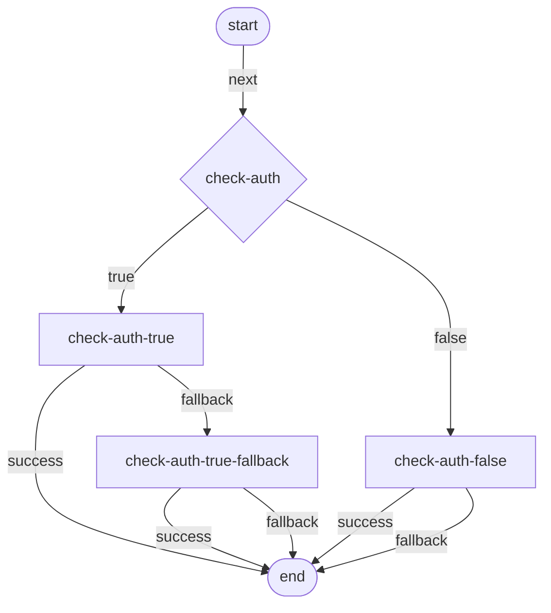

# ai-gateway-routes

Type-safe tooling for defining Cloudflare AI Gateway dynamic routes as YAML manifests or TypeScript builders, then compiling them to the flat JSON format accepted by the Cloudflare API.

## Installation

```sh
npm install ai-gateway-routes
```

## Quick Start

Write a route manifest:

```yaml
# auth-router.ai-gateway-route.yaml
name: auth-router
start: check-auth

models:
  openai:
    provider: openai
    model: gpt-4.1-mini
    timeout: 30
    retries: 2

  nvidia:
    provider: custom-nvidia
    model: nvidia/llama-3.1-nemotron-nano-8b-v1
    timeout: 30
    retries: 2

nodes:
  check-auth:
    conditional:
      conditions:
        metadata.signed_in:
          $eq: true
      true:
        model: openai
        success: end
        fallback:
          model: nvidia
          success: end
          fallback: end
      false:
        model: nvidia
        success: end
        fallback: end
```

Validate and compile it:

```sh
npx ai-gateway-routes validate auth-router.ai-gateway-route.yaml
npx ai-gateway-routes compile auth-router.ai-gateway-route.yaml -o route.json
```

The YAML format is intentionally manifest-like:

- `name` is the Cloudflare dynamic route name.
- `start` points to the first node.
- `models` is an optional catalog of model configurations that nodes can reference.
- `nodes` is a map of node IDs to exactly one node type.
- `end` is implicit and can be used as an output target.

The CLI validates the same graph rules as the TypeScript builder:

- exactly one implicit `start` and `end`
- every element is reachable from `start`
- all required outputs are connected
- all output references point to real element IDs
- the graph has no cycles
- fractional authoring buckets sum to `1`
- the final JSON passes the exported Zod schema

## CLI

```sh
ai-gateway-routes validate <route.yaml>
ai-gateway-routes compile <route.yaml> [-o route.json]
ai-gateway-routes visualize <route.yaml> [-o route.mmd]
ai-gateway-routes schema [-o ai-gateway-route.schema.json]
ai-gateway-routes deploy <route.yaml> --account-id <id> --gateway-id <id> --api-token <token>
```

The shorter `agr` binary is also available.

Deploy credentials can be passed as flags or environment variables:

```sh
CLOUDFLARE_ACCOUNT_ID=...
CLOUDFLARE_GATEWAY_ID=...
CLOUDFLARE_API_TOKEN=...

ai-gateway-routes deploy auth-router.ai-gateway-route.yaml
```

## YAML Element Types

Outputs can point to an existing node ID or define an inline node. Inline nodes are expanded into generated IDs when compiled, so Cloudflare still receives a flat `elements` array.

```yaml
nodes:
  check-auth:
    conditional:
      conditions:
        metadata.signed_in:
          $eq: true
      true:
        model: openai
        success: end
        fallback: end
      false: nvidia
```

### Model Catalog

```yaml
models:
  openai:
    provider: openai
    model: gpt-4.1-mini
    timeout: 30
    retries: 2

nodes:
  generate:
    model: openai
    success: end
    fallback: end
```

Catalog references are optional. You can still define a model inline when you need a one-off node.

### Conditional

```yaml
nodes:
  check-auth:
    conditional:
      conditions:
        metadata.signed_in:
          $eq: true
      true: openai
      false: nvidia
```

Supported condition operators:

- `$eq`
- `$neq`
- `$gt`
- `$lt`
- `$in`
- `$contains`

### Model

```yaml
nodes:
  openai:
    model:
      provider: openai
      model: gpt-4.1-mini
      timeout: 30
      retries: 2
      success: end
      fallback: backup
```

### Rate

```yaml
nodes:
  limit:
    rate:
      limitType: count
      key: metadata.user_id
      limit: 100
      window: 60
      success: openai
      fallback: end
```

### Percentage

```yaml
nodes:
  split:
    percentage:
      25%: control
      75%: treatment
```

### Fractional

`fractional` is an authoring convenience. It compiles to Cloudflare's `percentage` element type.

```yaml
nodes:
  split:
    fractional:
      buckets: [0.25, 0.75]
      bucket0: control
      bucket1: treatment
```

`bucket0` through `bucketN` must match the number of configured `buckets`, and bucket values must sum to `1`.

## VSCode Extension

A local VSCode extension package lives in `vscode/`. It recognizes:

- `*.ai-gateway-route.yaml`
- `*.ai-gateway-route.yml`
- `*.agroute.yaml`
- `*.agroute.yml`

It provides diagnostics while editing and commands to preview the flow, compile JSON, and copy Mermaid.

Local development:

```sh
npm run build
cd vscode
npm install
```

Then open the `vscode/` folder in VSCode and run the extension host.

## TypeScript Builder

The manifest workflow is the primary interface, but the TypeScript DSL is still available when routes need to be generated from code:

```ts
import { defineRoute } from "ai-gateway-routes";

const route = defineRoute("auth-router", (b) => {
  const checkAuth = b.conditional("check-auth", {
    conditions: { "metadata.signed_in": { $eq: true } },
  });

const openai = b.model("openai", {
  provider: "openai",
  model: "gpt-4.1-mini",
  timeout: 30,
  retries: 2,
});

const nvidia = b.model("nvidia", {
  provider: "custom-nvidia",
  model: "nvidia/llama-3.1-nemotron-nano-8b-v1",
  timeout: 30,
  retries: 2,
});

  b.fromStart().to(checkAuth);

  checkAuth.onTrue().to(openai);
  checkAuth.onFalse().to(nvidia);

  openai.onSuccess().toEnd();
  openai.onFallback().to(nvidia);

  nvidia.onSuccess().toEnd();
  nvidia.onFallback().toEnd();
});

const json = route.compile();
```

## TypeScript Element Types

### Start

`start` is implicit. Use `b.fromStart().to(node)` to connect it.

```ts
b.fromStart().to(model);
```

Output:

- `next`

### End

`end` is implicit. Use `toEnd()` from an output connector.

```ts
model.onSuccess().toEnd();
```

Outputs: none.

### Conditional

```ts
const checkAuth = b.conditional("check-auth", {
  conditions: {
    "metadata.signed_in": { $eq: true },
  },
});

checkAuth.onTrue().to(openai);
checkAuth.onFalse().to(nvidia);
```

Outputs:

- `true`
- `false`

Supported condition operators:

- `$eq`
- `$neq`
- `$gt`
- `$lt`
- `$in`
- `$contains`

### Model

```ts
const model = b.model("openai", {
  provider: "openai",
  model: "gpt-4.1-mini",
  timeout: 30,
  retries: 2,
});

model.onSuccess().toEnd();
model.onFallback().to(fallbackModel);
```

Outputs:

- `success`
- `fallback`

### Fractional

```ts
const split = b.fractional("split", {
  buckets: [0.5, 0.5] as const,
});

split.onBucket(0).to(modelA);
split.on("bucket1").to(modelB);
```

Outputs are generated from the bucket indexes:

- `50%`
- `25%`
- `75%`

When `buckets` is declared `as const`, TypeScript restricts bucket names and indexes to the declared tuple length.

`b.fractional()` compiles to Cloudflare's `percentage` element type.

## Programmatic Deploy

```ts
import { defineRoute, deploy } from "ai-gateway-routes";

const route = defineRoute("linear", (b) => {
  const model = b.model("openai", {
    provider: "openai",
    model: "gpt-4.1-mini",
        timeout: 30,
        retries: 2,
  });

  b.fromStart().to(model);
  model.onSuccess().toEnd();
  model.onFallback().toEnd();
});

await deploy(route, {
  accountId: "...",
  gatewayId: "...",
  apiToken: "...",
});
```

`deploy()` sends a `POST` request to:

```txt
https://api.cloudflare.com/client/v4/accounts/{accountId}/ai-gateway/gateways/{gatewayId}/routes
```

You can also pass already compiled JSON:

```ts
await deploy(route.compile(), {
  accountId: "...",
  gatewayId: "...",
  apiToken: "...",
});
```

## Zod Schemas

The package exports schemas for validating compiled routes, YAML manifests, or Cloudflare API responses:

```ts
import {
  CloudflareRouteSchema,
  YamlRouteSchema,
  validateCompiledRoute,
} from "ai-gateway-routes";

const parsed = CloudflareRouteSchema.parse(json);
const route = validateCompiledRoute(json);
```

Exported schemas:

- `CloudflareRouteSchema`
- `RouteElementSchema`
- `StartElementSchema`
- `EndElementSchema`
- `ConditionalElementSchema`
- `ModelElementSchema`
- `FractionalElementSchema`
- `ConditionsSchema`
- `ConditionExpressionSchema`
- `YamlRouteSchema`
- `YamlNodeSchema`
- `YamlRouteJsonSchema`

## Mermaid Visualization

From the CLI:

```sh
ai-gateway-routes visualize auth-router.ai-gateway-route.yaml -o route.mmd
```

From TypeScript:

```ts
import { visualize } from "ai-gateway-routes";

const diagram = visualize(route);
```

Output:



## Notes

Cloudflare's public API reference currently documents dynamic route creation at `POST /accounts/{account_id}/ai-gateway/gateways/{gateway_id}/routes`.

The package includes `schemas/cloudflare-route-create.schema.json`, extracted from Cloudflare's public OpenAPI schema. Refresh it with:

```sh
npm run schema:update
```

JSON Schema catches API shape changes. The compiler still adds route-graph validation that JSON Schema cannot express, such as dangling references, unreachable nodes, cycles, and fractional bucket sums.
